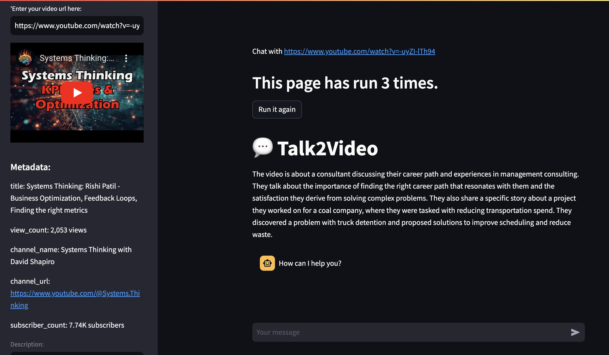

# Talk2YouTube

Talk2YouTube is a Streamlit-based application that allows users to interact with YouTube videos in a unique way. It enables the extraction of metadata and transcripts from YouTube videos, indexing this information for easy querying, and providing a chat interface where users can ask questions about the video's content. This tool leverages the power of OpenAI's API for natural language processing and the `llama_index` package for indexing and querying video content.

## Screenshot



## Features

- **YouTube Metadata and Transcript Extraction**: Fetches metadata and transcripts directly from YouTube videos.
- **Interactive Chat Interface**: Chat with the application to query information about the video's content.
- **Indexing and Querying**: Uses `llama_index` to create a searchable index of the video's transcript, enabling efficient content-based queries.
- **Streamlit Web Interface**: User-friendly web interface built with Streamlit for easy interaction.

## Prerequisites

Before you can use Talk2YouTube, you need to have the following:

- Python 3.6 or newer
- Streamlit
- OpenAI API key

## Installation

1. Clone the Talk2YouTube repository to your local machine.
2. Install the required Python packages:

    ```bash
    pip install streamlit openai llama_hub llama_index
    ```

3. Set your OpenAI API key as an environment variable or enter it in the Streamlit sidebar when running the application.

## Usage

To start the application, navigate to the Talk2YouTube directory and run:

```bash
streamlit run your_script_name.py
```

Replace `your_script_name.py` with the name of the script if you've renamed it.

In the Streamlit interface:

1. Enter your OpenAI API key in the sidebar (this is required for processing queries).
2. Enter the URL of the YouTube video you want to interact with.
3. View the video's metadata, transcript, and start chatting about the video content.

## How It Works

Talk2YouTube works by performing the following steps:

1. **Extracting Metadata and Transcript**: Given a YouTube video URL, the tool fetches the video's metadata and transcript using `fetch_youtube_metadata` and `YoutubeTranscriptReader` from `llama_hub`.
2. **Indexing**: It then indexes the transcript for querying using `llama_index`.
3. **Chat Interface**: Users can ask questions about the video content through a chat interface. The tool uses an OpenAI agent to process these queries and fetch relevant information from the indexed transcript or Wikipedia.

## Contributing

We welcome contributions to Talk2YouTube! Please feel free to submit pull requests or open issues to improve the project.

## License

MIT.
