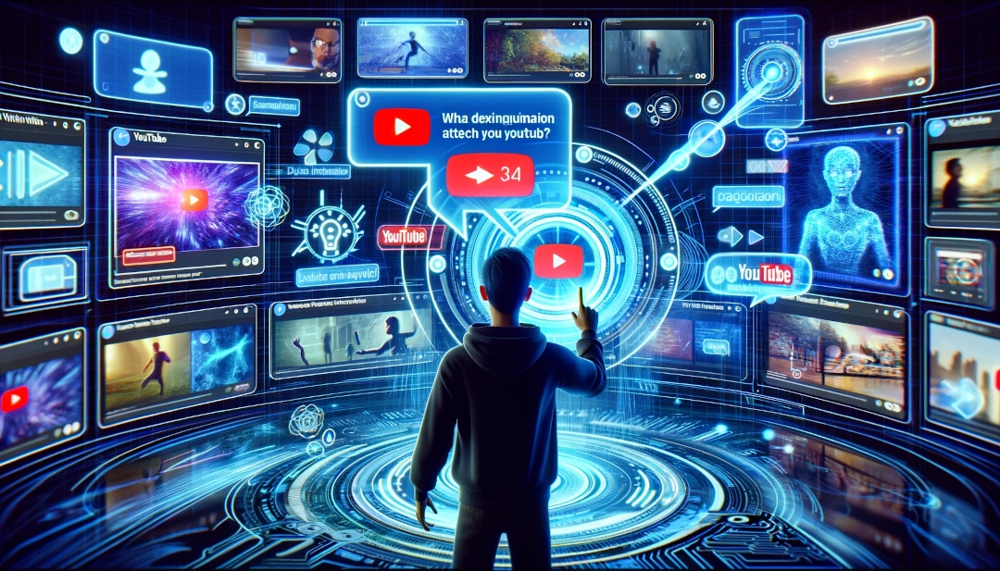

# Introducing Talk2YouTube: AI-Powered Video Content Interaction

In today's digital ecosystem, video content is king, commanding the attention of audiences worldwide. Among the giants of video sharing, YouTube stands as a colossus, brimming with endless data ripe for exploration. Yet, finding specific information amidst this vast sea of content often feels like a Herculean task. Enter `talk2youtube`, my latest creation designed to transform how we interact with video content. Discover its potential on GitHub: [meirm/talk2youtube](https://github.com/meirm/talk2youtube).

## Unveiling Talk2YouTube: A Spark of Innovation

Ever wondered what it would be like to hold a conversation with a YouTube video? Not merely skimming through it or perusing comments, but engaging in an actual dialogue to extract precise answers. This curiosity sparked the creation of `talk2youtube`, a tool that harnesses OpenAI's cutting-edge APIs and the indexing prowess of the LLaMA Index library.

## How Talk2YouTube Enhances Video Interaction

`talk2youtube` transcends traditional video downloaders and transcript extractors. It serves as a conduit between intricate video content and your quest for specific knowledge. Here's a glimpse into its operational magic:

1. **Metadata and Transcript Extraction**: Initially, `talk2youtube` retrieves the video's metadata and transcript, setting the stage for the ensuing magic.

2. **Content Indexing**: Leveraging the `llama_index` package, it indexes the video's transcript, rendering every spoken word searchable within a comprehensive database.

3. **AI-Driven Conversations**: At its heart, `talk2youtube` facilitates AI-powered dialogues, enabling users to pose questions and receive targeted information derived from the video's content.

## Embracing AI for Deeper Content Engagement

At the core of `talk2youtube` lies its AI component, which interprets natural language queries with remarkable intuition. This feature empowers a diverse array of users—from students and professionals to the innately curious—to navigate video content with unprecedented ease.

## The Essence of Talk2YouTube

In our fast-paced world, `talk2youtube` is more than a time-saver. It's a gateway to deeper understanding and interaction with the digital knowledge repository we've come to rely on. It heralds a new era of efficient learning and information discovery.

## Envisioning the Future

As `talk2youtube` continues to evolve, its journey is far from over. I dream of a future where it becomes an essential resource for educators, students, researchers, and the perpetually curious. Your insights and contributions are invaluable as we strive to enhance its functionality and reach.

## Let's Embark on This Journey Together

I warmly invite you to dive into the world of `talk2youtube`, to experiment with its features, and to join a burgeoning community of users and innovators. Together, we can reshape the way we engage with video content, unlocking new dimensions of knowledge and insight.

Start your journey by visiting the GitHub repository at [meirm/talk2youtube](https://github.com/meirm/talk2youtube), and let's navigate this exciting path together.
